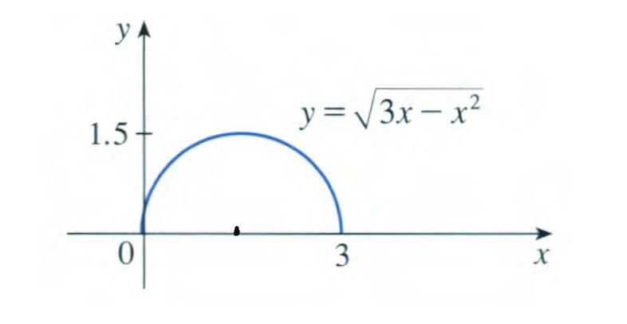
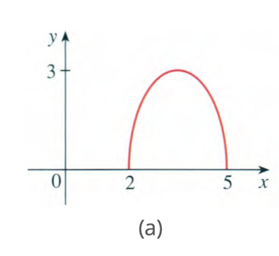
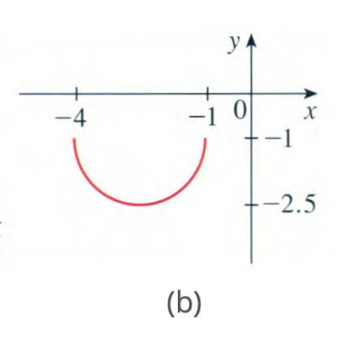

# Q1

 The graph of $\sqrt{3x - x^2}$ is given. Use transformations to create a function whose graph is as shown.

---

# Ans1

(a)

此圖形與原本的$\sqrt{3x - x^2}$相比水平右移了2單位，垂直拉伸了2倍，從原函數出發可得$y = 2\sqrt{3(x-2) - (x-2)^2}$，經過化簡後可得$y = 2\sqrt{-x^2+7x-10}$

(b)

此圖形與原本的$\sqrt{3x - x^2}$相比向左平移了四單位，並且沿x軸反轉（*-1），最後向下平移了一單位，從原函數出發可得$y=-\sqrt{3(x+4) - (x+4)^2} - 1$，經過化簡後可得$y = 2\sqrt{-x^2-5x-4}-1$

# Q2

 Some of the highest tides in the world occur in the Bay of Fundy on the Atlantic Coast of Canada. At Hopewell Cape the water depth at low tide is about 2.0 m and at high tide it is about 12.0 m. The natural period of oscillation is about 12 hours and on a particular day, high tide occurred at 6:45 AM. Find a function involving the cosine function that models the water depth D(t) (in meters) as a function of time t (in hours after midnight) on that day.Please find D(t) by transforming the basic cosine function cos(t). Explain the transformations.

---

# Ans2

1. 垂直平移（決定中線）
   * 低潮水深： 2.0 公尺
    * 高潮水深： 12.0 公尺
* 代表中線在7公尺，所以整個函數圖形要向上平移7個單位，最後整個函數要$+ 7$

2. 振幅（決定浪高）
   * 高潮水深 - 中線 = 12.0 - 7.0 = 5.0 公尺
* 原本cos的函數圖形高為1個單位，所以整個函數圖形要被垂直拉伸5倍，代表最後函數要$\times 5$
3. 週期（決定循環時間）
    * 已知週期： T = 12 小時
    * 週期公式為2π / T = 2π / 12 = π/6
* 原本的函數週期為2π，這個變換會導致圖形的水平拉伸。餘弦函數內部 (π/6) 這個係數將週期從 2π 調整為 12 小時
4. 相位移（決定水平平移）
   * 高潮時間： 上午 6:45 = 6.75小時
* 原本cos的函數圖形的最大值出現在t = 0的位置，因此需將圖形向右移動6.75個單位，代表t要替換成(t-6.75)

最後的函數表示為$D(t) = 5 \cos\left( \frac{\pi}{6} (t - 6.75) \right) + 7$

# Q3

Let $f(x) = \sqrt{25x - x^2}$ , $g(x) = \sqrt{x + 1}$

1. Find f + g and its domain.
2. Find f - g and its domain. 
3. Find fg and its domain. 
4. Find $\frac{f}{g}$ and its domain.

# Ans3 
1. 
   * $(f + g)(x) = f(x) + g(x) = \sqrt{25 - x^2} + \sqrt{x + 1}$
   * $\text{Domain: } [-1,\, 5]$

2. 
    * $(f - g)(x) = f(x) - g(x) = \sqrt{25 - x^2} - \sqrt{x + 1}$
    *  $\text{Domain: } [-1,\, 5]$
3. 
   * $(fg)(x) = f(x) \cdot g(x) = \sqrt{25 - x^2} \cdot \sqrt{x + 1}$
   * $\text{Domain: } [-1,\, 5]$
4. 
   * $\left( \frac{f}{g} \right)(x) = \frac{f(x)}{g(x)} = \frac{\sqrt{25 - x^2}}{\sqrt{x + 1}}$
   * $\text{Domain: } (-1,\, 5]$

  