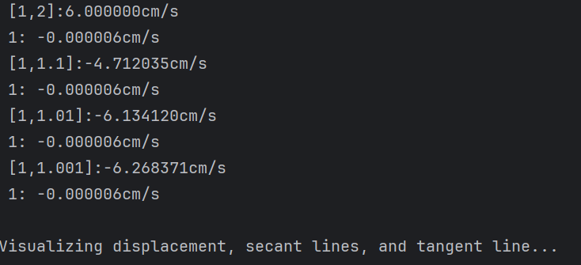

---
pdf_options:
  printBackground: true
  displayHeaderFooter: true
  headerTemplate: '<div></div>'
  footerTemplate: '<div style="font-size:10px;text-align:center;width:100%;"><span class="pageNumber"></span> / <span class="totalPages"></span></div>'
  margin:
    top: "1.5cm"
    bottom: "2.0cm"
---
<!DOCTYPE html>
<html>
<head>
<meta charset="UTF-8">
<link rel="stylesheet" href="https://cdn.jsdelivr.net/npm/katex@0.16.9/dist/katex.min.css">
<script defer src="https://cdn.jsdelivr.net/npm/katex@0.16.9/dist/katex.min.js"></script>
<script defer src="https://cdn.jsdelivr.net/npm/katex@0.16.9/dist/contrib/auto-render.min.js"></script>
<script>
document.addEventListener("DOMContentLoaded", function() {
  renderMathInElement(document.body, {
    delimiters: [
      {left: "$$", right: "$$", display: true},
      {left: "$", right: "$", display: false}
    ],
    throwOnError: false
  });
});
</script>
<style>
  .cover-page {
    page-break-after: always;
    text-align: center;
    padding-top: 30vh;
  }
  .cover-main-title {
    font-size: 48px;
    font-weight: bold;
    margin-bottom: 30px;
    line-height: 1.5;
  }
  .cover-subtitle {
    font-size: 24px;
    color: #000000ff;
    margin-bottom: 60px;
    line-height: 1.6;
  }
  .cover-group {
    font-size: 18px;
    color: #000000ff;
    margin-bottom: 40px;
  }
  .cover-authors {
    font-size: 18px;
    color: #000000ff;
    line-height: 2;
  }
</style>
</head>
<body>
</body>
</html>

<div class="cover-page">
  <div class="cover-main-title">
    Calculus
  </div>
  <div class="cover-subtitle">
    Understand Function Transform and Exploring Tangent Problems
  </div>
  <div class="cover-group">
    組別：第15組
  </div>
  <div class="cover-authors">
    組員：<br>
    411485018 蘇星丞<br>
    411485002 楊昕展<br>
    411485003 胡庭睿<br>
    411485042 黃柏崴
  </div>
</div>

<div style="page-break-after: always;"></div>

# Solve Transformations and Composition

## Q1

 The graph of $\sqrt{3x - x^2}$ is given. Use transformations to create a function whose graph is as shown.


## Ans1


此圖形與原本的$\sqrt{3x - x^2}$相比水平右移了2單位，垂直拉伸了2倍，從原函數出發可得$y = 2\sqrt{3(x-2) - (x-2)^2}$，經過化簡後可得$y = 2\sqrt{-x^2+7x-10}$


此圖形與原本的$\sqrt{3x - x^2}$相比向左平移了四單位，並且沿x軸反轉（$\times -1$），最後向下平移了一單位，從原函數出發可得$y=-\sqrt{3(x+4) - (x+4)^2} - 1$，經過化簡後可得$y = 2\sqrt{-x^2-5x-4}-1$

---

## Q2

 Some of the highest tides in the world occur in the Bay of Fundy on the Atlantic Coast of Canada. At Hopewell Cape the water depth at low tide is about 2.0 m and at high tide it is about 12.0 m. The natural period of oscillation is about 12 hours and on a particular day, high tide occurred at 6:45 AM. Find a function involving the cosine function that models the water depth D(t) (in meters) as a function of time t (in hours after midnight) on that day.Please find D(t) by transforming the basic cosine function cos(t). Explain the transformations.


## Ans2

1. 垂直平移（決定中線）
   * 低潮水深： 2.0 公尺
   * 高潮水深： 12.0 公尺
* 代表中線在7公尺，所以整個函數圖形要向上平移7個單位，最後整個函數要$+ 7$

2. 振幅（決定浪高）
   * 高潮水深 - 中線 = 12.0 - 7.0 = 5.0 公尺
* 原本cos的函數圖形高為1個單位，所以整個函數圖形要被垂直拉伸5倍，代表最後函數要$\times 5$
3. 週期（決定循環時間）
    * 已知週期： T = 12 小時
    * 週期公式為2π / T = 2π / 12 = π/6
* 原本的函數週期為2π，這個變換會導致圖形的水平拉伸。餘弦函數內部 (π/6) 這個係數將週期從 2π 調整為 12 小時
4. 相位移（決定水平平移）
   * 高潮時間： 上午 6:45 = 6.75小時
* 原本cos的函數圖形的最大值出現在t = 0的位置，因此需將圖形向右移動6.75個單位，代表t要替換成(t-6.75)

最後的函數表示為$D(t) = 5 \cos\left( \frac{\pi}{6} (t - 6.75) \right) + 7$

---

## Q3

Let $f(x) = \sqrt{25 - x^2}$ , $g(x) = \sqrt{x + 1}$

1. Find $f + g$ and its domain.
2. Find $f - g$ and its domain. 
3. Find $fg$ and its domain. 
4. Find $\frac{f}{g}$ and its domain.

## Ans3 
1. 
   * $(f + g)(x) = f(x) + g(x) = \sqrt{25 - x^2} + \sqrt{x + 1}$
   * $\text{Domain: } [-1, 5]$
      * $\text{Domain}$為 $f(x)$ 和 $g(x)$ 定義域的交集。
      * $f(x)$ 的定義域: $[-5, 5]$
      * $g(x)$ 的定義域: $[-1, \infty)$
      * 兩者的交集為 $[-1, 5]$

2. 
    * $(f - g)(x) = f(x) - g(x) = \sqrt{25 - x^2} - \sqrt{x + 1}$
    *  $\text{Domain: } [-1, 5]$
         * $\text{Domain}$為 $f(x)$ 和 $g(x)$ 定義域的交集。
         * $f(x)$ 的定義域: $[-5, 5]$
         * $g(x)$ 的定義域: $[-1, \infty)$
         * 兩者的交集為 $[-1, 5]$
3. 
   * $(fg)(x) = f(x) \cdot g(x) = \sqrt{25 - x^2} \cdot \sqrt{x + 1}$
   * $\text{Domain: } [-1, 5]$
      * $\text{Domain}$為 $f(x)$ 和 $g(x)$ 定義域的交集。
      * $f(x)$ 的定義域: $[-5, 5]$
      * $g(x)$ 的定義域: $[-1, \infty)$
      * 兩者的交集為 $[-1, 5]$
4. 
   * $\left( \frac{f}{g} \right)(x) = \frac{f(x)}{g(x)} = \frac{\sqrt{25 - x^2}}{\sqrt{x + 1}}$
   * $\text{Domain: } (-1, 5]$
      * $\text{Domain}$為 $f(x)$ 和 $g(x)$ 定義域的交集，且分母$g(x)$**不可為零**
      1.  先找出定義域交集：$[-1, 5]$。
      2.  接著，找出使 $g(x) = 0$ 的點：
            *   $\sqrt{x + 1} = 0$
            *   $x + 1 = 0$
            *   $x = -1$
      3.  因此，須從交集 $[-1, 5]$ 中排除 $x = -1$ 這一點。
      *  可知三者的交集為 $(-1, 5]$

---
## Q4
---
## Q5
---
## Q6
---
---
# Slope of the Tagent Line

## Q1
A student bought a smartwatch that tracks the number of steps she walks throughout the day. The table shows the number of steps recorded t minutes after 3:00 PM on the first day she wore the watch.


1. Find the slopes of the secant lines corresponding to the given intervals of t.
    * [0,40]
    * [10,20] 
    * [20,30]

2. What do the above slopes represent?
3. Estimate the student's walking pace, in steps per minute, at 3:20 PM by averaging the slopes of two secant lines.

## Ans1

1. 假設[t1,t2]為時間經過的區間，$f(t1)$,$f(t2)$分別為他們對應的值，斜率$m_{t_1t_2} = \frac{f(t_2) - f(t_1)}{t_2 - t_1}$。
    * [0,40] 
   
   $m_{t_1t_2} = \frac{7398 - 3438}{40 - 0} = \frac{3960}{40} = 99.0$  
    * [10,20] 
   
   $m_{t_1t_2} = \frac{5622 - 4559}{20 - 10} = \frac{1063}{10} = 106.3$  
    * [20,30] 
   
   $m_{t_1t_2} = \frac{6536 - 5622}{30 - 20} = \frac{914}{10} = 91.4$

2. 上述斜率代表在此區間經過時間的平均行走步數(steps)速率(步/每分鐘)，意味著每分鐘所走的步數箱等，不過，經過時間為我們可控的尺度內，因為一分鐘之內一定不是每秒速率相等(我們不考慮)。

3. 承1.由於想推估下午3:20，我們取1.算好的[10,20],[20,30]做平均(因為其他資訊不知)，即$\frac{m[10,20]+m[20,30]}{2}$ = $\frac{91.4+106.3}{2}$=$98.85$。
故在下午3:20這點步行速率推估是$98.85$步/每分鐘。
   
---
## Q2

The point $P(0.5, 0)$ lies on the curve $y = cos(x)$ 
1. If Q is the point $(x,\cos\pi x)$, find the slope of the secant line PQ (correct to six decimal places) for the following values of x:
    * x = 0,0.4,0.49, 0.499
    * x = 1, 0.6, 0.51, 0.501 
2. Using the above results to guess the value of the slope of the tangent line to the curve at $P(0.5, 0)$?

## Ans2

$m_{PQ} = \frac{y - y_0}{x - 0.5} = \frac{\cos(\pi x) - 0}{x - 0.5} = \frac{\cos(\pi x)}{x - 0.5}$

1. 
    $m_{PQ} = \frac{\cos(\pi \cdot 0)}{0 - 0.5} = \frac{1}{-0.5} = -2$

    $m_{PQ} = \frac{\cos(\pi \cdot 0.4)}{0.4 - 0.5} = -3.090170$
        
    $m_{PQ} = \frac{\cos(\pi \cdot 0.49)}{0.49 - 0.5}  = -3.141076$
        
    $m_{PQ} = \frac{\cos(\pi \cdot 0.499)}{0.499 - 0.5}  = -3.141587$
2. 根據上面的結果，$Q$從左邊(x小於0.5)越來越接近P時，在$x=0.499$時$m_{PQ}$的斜率是$-3.141587$；而$Q$從右邊(x大於0.5)越來越接近P時，在$x=0.501$時$m_{PQ}$的斜率也是$-3.141587$，所以我們可以大膽猜測在$P(0.5,0)$這點的切線斜率為$-3141587$。


---

# Analyze Instantaneous Velocity

```python
from particle_velocity import displacement, average_velocity, instantaneous_velocity
import numpy as np
import matplotlib.pyplot as plt


intervals = [(1, 2), (1, 1.1), (1, 1.01), (1, 1.001)]
for t1, t2 in intervals:
    v_avg = average_velocity(t1, t2)
    print(f" [{t1},{t2}]:{v_avg:.6f}cm/s")


    t_interest = 1
    v_instant = instantaneous_velocity(t_interest)
    print(f" {t_interest}: {v_instant:.6f}cm/s")


 


def viz_velocities(t_start, t_end, t_interest, intervals):
    """
    Plot displacement s(t), secant lines for average velocities,
    and tangent line for instantaneous velocity at t=t_interest.
    """
    step = 0.01 #每0.01取一個值
    t_values = np.arange(t_start, t_end + step, step) #從開始到結束每一個0.01取一個值
    s_values = [displacement(t) for t in t_values] #每個值算出一段位移
 
    plt.figure(figsize=(8, 5)) #設定圖片大小
    plt.plot(t_values, s_values, label="Displacement", color='blue')
    #畫橫軸t_values、縱軸s_values、設定圖形標籤為Displacement、設定顏色為藍色
   
    intervals = [(1, 2), (1, 1.1), (1, 1.01), (1, 1.001)] #定義區間
    colors = ['red', 'orange', 'green', 'purple'] #定義顏色

    line_width = 0.5 #設定線寬，讓直線延伸，視覺效果更加
    line_samples = 50 #取樣50個點
    for (t1, t2), c in zip(intervals, colors): #一組間隔對應一組顏色
        v_avg = average_velocity(t1, t2) #求t1,t2間的平均速率
        t_secant = np.linspace(t1 - line_width, t2 + line_width, line_samples)
        #在t1 - line_width, t2 + line_width的範圍內取50個點
        s_secant = displacement(t1) + v_avg * (t_secant - t1)
        #用平均速率的斜率計算點的位置
        plt.plot(t_secant, s_secant, label=f"Secant [{t1}, {t2}] (v_avg={v_avg:.2f})", color=c, linestyle='--')
        #劃出(t_secant, s_secant)的位置，並加上圖利標示，選定顏色跟顯示圖案


    v_instant = instantaneous_velocity(t_interest) #求在t_interest的順時速率
    t_tangent = np.linspace(t_interest - line_width, t_interest + line_width, line_samples)
    #在t1 - line_width, t2 + line_width的範圍內取50個點
    s_tangent = displacement(t_interest) + v_instant * (t_tangent - t_interest)
    #用該點的斜率計算點的位置
    plt.plot(t_tangent, s_tangent, label=f"Tangent at t={t_interest} (v_instant={v_instant:.2f})", color='black', linestyle='-.')# 劃出(t_tangent, s_tangent)的位置，並加上圖利標示，選定顏色跟顯示圖案


    plt.scatter([t_interest], [displacement(t_interest)], color='black', zorder=5)
    #在(x, y) = (t_interest, displacement(t_interest))劃一個黑點
    plt.text(t_interest, displacement(t_interest)+line_width, f"t={t_interest}", ha='center')
    #在點(x, y) = (t_interest, displacement(t_interest))上方line_width的地方寫出文字t_interest並置中對齊


    plt.xlabel("Time t (s)") #X座標設為時間
    plt.ylabel("Displacement s (cm)") #Y座標設為位移
    plt.title("Particle Displacement, Secant Lines, and Tangent Line") #設定標題名稱
    plt.grid(True) #加上格線
    plt.legend() #顯示圖例標籤
    plt.savefig("velocities.png", dpi=300, bbox_inches='tight') #儲存圖片
    plt.close()  #釋放


print("\nVisualizing displacement, secant lines, and tangent line...") #印出文字
viz_velocities(0, 3, t_interest, intervals) #執行上述定義之指令


```
執行結果：



```python


import math
from math import sin, cos, pi


#位移的函式，依照給的公式計算
def displacement(t):
    s = 2 * sin(pi * t) + 3 * cos(pi * t)
    displacement = s
    return displacement


#平均速率的函式，delta(s)/delta(t)
def average_velocity(t_start, t_end):
    s1 = displacement(t_start)
    s2 = displacement(t_end)
    avg_vel = (s2 - s1) / (t_end - t_start)

    velocity = avg_vel
    return velocity

#瞬時速率的函式，ds/dt
def instantaneous_velocity(t, delta=1e-6):
    s1 = displacement(t)
    s2 = displacement(t + delta)
    inst_vel = (s2 - s1) / (t + delta)

    velocity = inst_vel
    return velocity
```


---
# Team Division

| 學號姓名 | 工作時間 | 分配項目（寫） | 分配項目（檢查） |
| --- | --- | --- | --- |
| 411485002 楊昕展 |  |  |  |
| 411485003 胡庭睿 |  |  |  |
| 411485018 蘇星丞 | 5小時 | 程式部分 | 第一部分4-6 |
| 411485042 黃柏崴 |  |  |  |

---


# Reflection

### 學號：411485018
### 姓名：蘇星丞
### 心得：
這次我負責的地方是程式，這次的工作量真的有變多也變複雜，但我這部分的能力確實有點不足，所以我都會一直問同組組員跟AI，這次的作業我學到了很多函式的格式和我沒有學過的部分，也搞清楚每個變數在幹嘛，這次的作業也有很多令我卡住的時候，像是有些式子不像數學那麼直觀，也有那些為了美觀或視覺效果所做的修正也很反直覺，至少對第一次寫那麼多程式的我來說，希望我之後可以有機會再做程式，讓我有機會學到更多東西

---

### 學號： 411485003
### 姓名： 胡庭睿
### 心得：


---

## 學號：
## 姓名：
## 心得：

---
## 學號：
## 姓名：
## 心得：